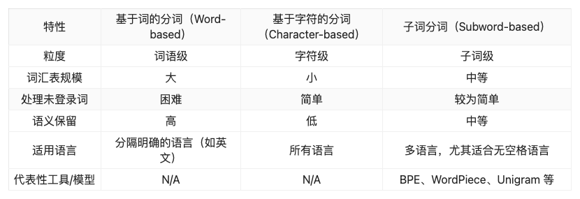

需要对数据进行预处理，消除低质量、冗余、无关甚可能有害的数据。一般来说，需要构建并使用系统化的数据处理框架，构建和使用系统化的数据处理框架可以显著提高数据预处理的效率和一致性。Data-Juicer 是一个开源的数据处理库，提供了多种工具和模块。例如开源库 Data-Juicer。典型的数据预处理流程如图 1.2 所示，包括质量过滤、敏感内容过滤、数据去重等步骤。

图 1.2 LLM 预训练数据预处理流程

### 1.2.1 质量过滤

- 人为设定规则：比如去掉网页标签、&nbsp、%20、\u3000 等无用字符，结合关键词集合进行过滤。使用单词比率等统计特征来衡量文本质量。
- Perplexity 困惑度：Perplexity 本质是根据之前所有的 token 预测下一个 token 生成的概率值，比如 `I am a` 这三个 token 后面跟上 student 的概率较大，生成评估指标来检测和删除表达不自然的句子，以及训练 FastText 分类器来检测有毒或仇恨言论。

### 1.2.2 敏感内容过滤

- 精确过滤含有有毒内容的文本，例如 Dolma 采用规则方法来过滤邮箱地址、IP 地址以及电话号码，如果文档中的隐私信息少于五条则使用使用特定的词元进行替换（如“[EMAIL_ADDRESS]”），如果隐私信息达到六条则直接删除整个文档。

### 1.2.3 冗余去重：

- 利用向量数据库：先用 embedding 模型把文本转成向量，然后存储向量数据库；每个新向量存入向量数据库时先计算一下库里面有没有相似度大于阈值(比如 0.8)的向量，没有再入库；有就说明重复了，直接丢弃。等所有的文本都这么操作一次后，向量数据库的数据就是唯一数据，这种思路本质是利用向量数据库去重。
- 在去重过程中，可以使用精确匹配算法（即每个字符完全相同）或近似匹配算法（基于相似度）。对于精确匹配，通常使用后缀数组来匹配最小长度的完全相同子串；对于近似匹配，可以采用局部敏感哈希（Locality-Sensitive Hashing, LSH）算法，如最小哈希（MinHash） 来实现。为了平衡去重效率和效果，实际操作通常会结合多种匹配方法，例如在文档层面采用近似匹配而在句子层面采用精确匹配。

### 1.2.4 tokenizer 分词

将原始连续的文本数据切分成更小的单元（称为词元或 tokens）的过程，作为大语言模型的输入数据。Tokenizer 包括训练和推理两个环节。训练阶段指得是从语料中获取一个分词器模型。推理阶段指的是给定一个句子，基于分词模型切分成一连串的 token。
分词方法主要可以分为 基于词（Word-based）、基于字符（Character-based）和子词（Subword-based） 三种类型。

1)基于词（Word-based）

基于词的分词方法按照完整的词语进行切分，通常依赖于空格、标点符号等显式的分隔符。每个词语作为一个独立的词元。
示例：

- 英文句子：“Today is Sunday.”
- 分词结果：`[Today, is, Thursday, .]`
  依赖于空格、标点等显式分隔符，适用于分隔明确的语言（如英文)。适用于词语分隔明确且词汇相对固定的语言和任务，如英文文本分类、情感分析等

  2)基于字符（Character-based）

基于字符的分词方法将文本按照单个字符进行切分，每个字符作为独立的词元，视其为最小的语言单元
示例：

- 英文句子：“Today is Sunday.”
- 分词结果：`[T, o, d, a, y, , i, s, , T, h, u, r, s, d, a, y, .]`
  语义信息缺失：单个字符缺乏完整的语义，难以捕捉词语层面的信息。上下文依赖大：需要更深层次的模型来理解字符序列的语义关系，增加了模型复杂性。适用于任何语言，不依赖于词语分隔符适用于需处理多语言或存在大量未登录词的任务，如跨语言文本生成、多语言情感分析等。

  3)子词（Subword-based）

子词分词方法将词语切分为更小的子词单元（subwords），既能保留部分词语的完整性，又能有效处理未登录词和复合词，保留了部分词语的语义信息，且能够灵活应对新词或复合词。词汇表规模适中：通过子词组合表达多样化的词语，词汇表不至于过大。
示例：

- 英文句子：“Today is Sunday.”
- 分词结果：`[To, day, is, Thurs, day, .]`
  广泛应用于现代预训练语言模型（如 BERT、GPT、T5）中，用于提升模型的表示能力和语言理解效果。
  
- BPE

BPE 最初用于数据压缩，后来被引入到 NLP 领域作为一种子词分词方法。通过迭代地合并最频繁出现的字符对，BPE 能够有效地生成子词单元
步骤：

1. 初始化：将每个词拆分为单个字符，包括特殊字符（如“##”用于表示词的延续）。
2. 统计频率：统计所有相邻字符对的出现频率。
3. 合并：找到出现频率最高的字符对，并将其合并为一个新的子词单元。
4. 迭代：重复步骤 2 和 3，直到达到预定的词汇表大小或合并次数。

- WordPiece

WordPiece 是由 Google 提出的一种子词分词方法，最初应用于 Google 的机器翻译系统，后被 BERT 等模型采用。WordPiece 旨在最大化训练数据的似然估计。
步骤：

1. 初始化：将所有词拆分为单个字符或现有子词单元。
2. 训练目标：通过最大化训练数据中子词序列的似然概率来学习子词词汇表。
3. 合并规则：在每次迭代中，选择能最大化整体似然性的子词合并，并将其加入词汇表。
4. 迭代：重复上述步骤，直到达到预定的词汇表大小。

- Unigram

基于概率模型的子词分词算法，由 Google 的 SentencePiece 提出。不同于 BPE 和 WordPiece，Unigram 使用概率模型来选择最佳的子词分割方案
步骤：

1. 初始化：生成一个包含大量潜在子词单元的初始词汇表。
2. 训练模型：通过最大化训练数据中所有可能分词方案的似然概率，训练一个独立的概率模型。
3. 优化词汇表：移除对整体似然贡献较小的子词单元，逐步缩减词汇表大小，直到达到预定的词汇表规模。
4. 分词：在应用阶段，使用概率模型选择最具可能性的子词序列。

- 三种子词分词方法的对比
  
- 三种分词方法的典型场景
  
